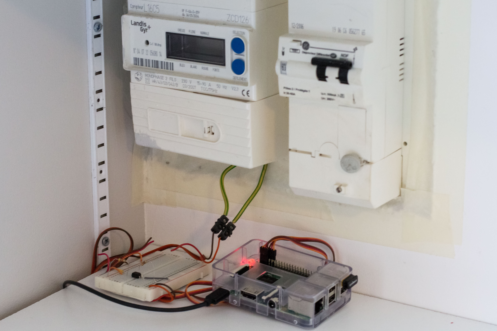
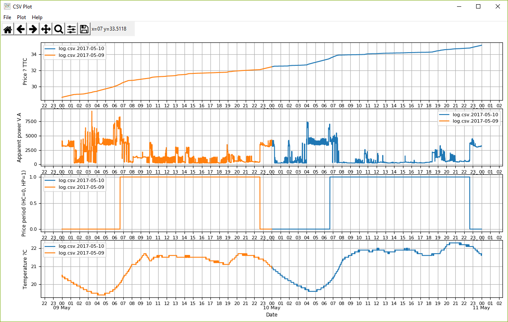

# Teleinfo

1. Lecture des informations envoyées par un compteur électrique EDF pour relever la consommation électrique:
* Puissance apparente
* Coût (en renseignant les tarifs HC et HP)
* Période tarifaire

Les mesures sont faites toutes les 30 secondes (configurable).
Utilisation d'un Raspberry Pi 2, connecté à la sortie Teleinfo du compteur EDF (liaison série) par l'intermédiaire d'un optocoupleur.

2. Utilisation d'un **Sensor Tag** de Texas Instrument, disponible chez Farnell pour 30 €.

Ce capteur permet de mesurer à distance (Bluetooth Low Energy) toutes les 30 secondes la température, la pression atmosphérique et l'hygrométrie.

[Sensor Tag](http://www.ti.com/ww/en/wireless_connectivity/sensortag/)

3. Visualisation des courbes avec **CSV Plot**.

Ce programme utilise la librairie Python *matplotlib*, il est compatible Windows (lancer CSVplot.bat) et Linux (lancer CSVplot.sh)

